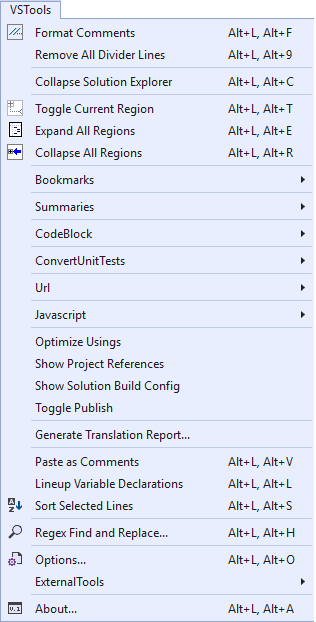

# VSTools
Development Tools

This solution creates an VSIX extension for use with Visual Studio 2019 providing many new easy to use features items to aid in development.

<p>For more in-depth information, be sure to consult the <a href="https://sokooltools.github.io/VSTools/Help/help.htm" target="_blank" title="VSTools Help" rel="nofollow">Help</a> documentation.</p>




<hr>

```javascript
--------------------------------
Format Comments
Remove All Divider Lines
--------------------------------
Collapse Solution Explorer
--------------------------------
Toggle Current Region
Expand All Regions
Collapse All Regions
--------------------------------
Bookmarks
	Cut
	Copy
	Delete
--------------------------------
Summaries  
	Collapse All  
	Expand All  
--------------------------------
CodeBlock  
	Collapse  
	Expand  
--------------------------------
ConvertUnitTests  
	MSTest to nUnit  
	nUnit to MSTest  
--------------------------------
Url  
	Encode  
	Decode  
--------------------------------
Javascript  
	Format  
	Compact  
--------------------------------
Optimize Usings  
Show Project References  
Show Solution Build Config  
Toggle Publish  
--------------------------------
Generate Translation Report...
--------------------------------
Paste as Comments
Lineup Variable Declarations
Sort Selected Lines
--------------------------------
Regex Find and Replace...
--------------------------------
Options...
External Tools
	External Tool 1
	External Tool 2
--------------------------------
```